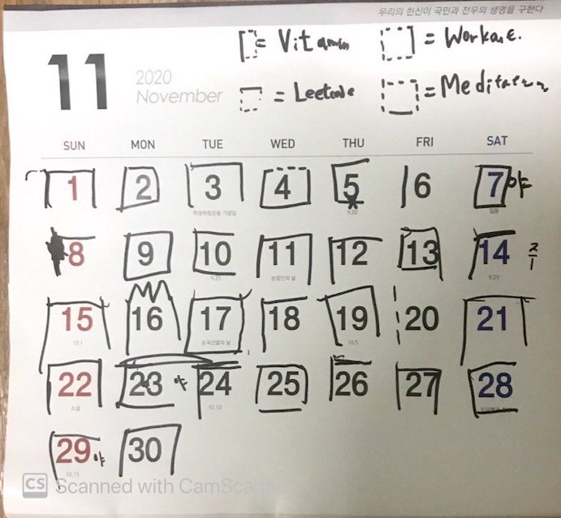

# Life Tracker

The first time I really felt the line "There is not enough time" was in Summer 2017 when I had my software engineering internship in NYC. I was double majoring in school and overloaded with courses almost every semester so thought 'how busier could I get?' Well, it turned out I could get a lot busier. After waking up at 7:15 to have breakfast I left my house at 8:10 sharp. This gave me barely enough time to arrive at work around 8:55 if the NYC metro was being generous that day. Work ended around 6:30 p.m. and after I came back home and had dinner it was already 8:30 p.m. That gave me enough time to workout and hangout with my friends for an hour or two. I usually sacrificed some sleep and relied on coffee so I could survive through the day. I drank more coffee in Summer 2017 than I had drank my whole life till then.

That Summer kindled an interest about 'time' for me and I would google time-related Ted talks and read about it. Then I joined the army. Through life we all have to deal with some amount of bullshit. This could be due to bureaucracy of an organization, the nature of logistics, difficulty of relationship between people or other things. The army is the peak of all of these. All out of nowhere, I had to deal with so much bullshit. I felt like my time was constantly being jeopardized. I hated it. Some people could argue you get to have a lot of time to think in the army but I didn't need time to think. I needed time to do meaningful things and grow. This constant mix of frustration and anger threw me down the thought process of how I should spend my time in the army.

Life is a series of moments when differentiated. Just like a movie is a number of pictures shown consecutively, our life is a consecutive series of moments. When we try to integrate it it would be this graph-like flow with ups and downs. I visualize this like a graph where the turning points are created by decisions that we make. So I wanted to visualize how my time was spent. This zoomed in perspective of life would help me better understand how my time is spent, and hopefully give me a better idea of who I am and help me make the bigger decisions as well.

I started tracking my life in various ways from moving paper clips from a set of boxes to another set of boxes by category such as 'Did I work out that day?' or 'Did I get enough work done that day?', etc. I started drawing squares on my calendar with each axis of square representing a boolean value of certain question. Last month I began tracking my hours more quantitatively to try analyzing the data with programming.

From 10/12 to 12/13, I tracked 55 of those days on about 30 columns such as

- number of hours lived
- number of hours spent working
- number of hours spent working out
- body weight
- number of pages read
- happiness score
- efficiency score
etc

Below are the November and Calendar photos of my Calendar on the wall with squares.

Left vertical axis: Vitamin pill
Upper horizontal axis: Did I work that day(not my daily job but something I do for myself)
Right vertical axis: Working out
Lower horizontal axis: Meditation
